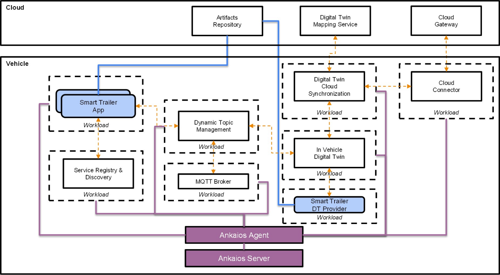

# Software Orchestration Blueprint

The **Software Orchestration Blueprint** showcases how an example in-vehicle software architecture with connectivity to the cloud can help developers manage complex services and applications. It enables advanced scenarios like workload orchestration, scheduling, placement and resilience. The abstraction layers provided by the blueprint aim to simplify and enhance the developer experience. These include discovery and consumption of resources and services, support for a common vehicle model to be used across vehicles, dynamic topic management for publish and subscribe of vehicle signals, and synchronization of signals to a cloud digital twin.

## Sample Use Case
The blueprint will come with a sample use case. The system detects that a smart trailer is being connected to the car. A signal is raised to the orchestrator that a smart trailer provider and application is required to manage the smart trailer and adjust body functions and powertrain accordingly and ensure a smooth trip. There are safety and security implications with the orchestration of this use case and that will be addressed in a future iteration.

## Architecture

**Implementation with Eclipse Ankaios**

**Implementation with Eclipse BlueChi**

## Getting Started

This repository will contain an implementation with
[eclipse-ankaios](https://github.com/eclipse-ankaios/ankaios) and another with
[eclipse-bluechi](https://github.com/eclipse-bluechi/bluechi) orchestrators. Please see the
documentation under each orchestrators' folder to get started.
