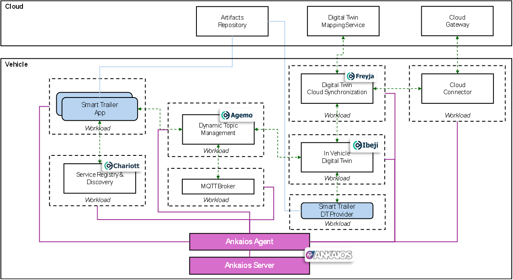

# Blueprint with Ankaios orchestrator


**Architectural Overview**




The container is designed to have an immediately running environment. Once triggered, all workloads are initially started and sample data is exchanged between them.

## Links

- [Ankaios docs](https://eclipse-ankaios.github.io/ankaios/0.3/)
- [Ankaios quickstart](https://eclipse-ankaios.github.io/ankaios/0.3/usage/quickstart/)
- [Podman](https://docs.podman.io/en/v4.6.1/)
- [What are devcontainers?](https://containers.dev/)

## Prerequisites

- Docker [Installation instructions](https://docs.docker.com/get-docker/)

## Devcontainer environment

The following is provided inside the devcontainer:

- Ankaios executables (`ank-server`, `ank-agent` and `ank`)

- Podman 4.6.2

- Pre-configured Ankaios manifest [startupState.yaml](./config/startupState.yaml)

- Automation scripts for starting and stopping all workloads of the scenario:
    - run_blueprint.sh
    - shutdown_blueprint.sh

- Exposed port:
    - 25551: for optionally using the Ankaios CLI outside of the devcontainer

- [Ankaios Control Interface dependencies](#ankaios-control-interface-dependencies)


All services are running in the host network meaning those can be accessed by `localhost:<port>`. We recommend that you set the network mode to host for all your developed workloads as well.

### Run devcontainer with VSCode

#### Prerequisites
- [Remote Development](https://marketplace.visualstudio.com/items?itemName=ms-vscode-remote.vscode-remote-extensionpack) extension installed in VSCode

Open the subfolder containing this README file in VSCode:

```shell
code .
```

__Note:__ If you have not installed and enabled [docker buildx](https://github.com/docker/buildx) you need to specify the `TARGETARCH` manually by providing it as build argument inside the `.devcontainer/devcontainer.json`, e.g.: --build-arg TARGETARCH=amd64.

VSCode detects automatically that a `.devcontainer` folder exists inside this subfolder.
Please confirm the dialog to reopen VSCode inside the devcontainer.
Afterwards, open a new terminal inside the devcontainer in VSCode.

### Run devcontainer without VSCode

Navigate to the subfolder containing this README file and run the following command to build the devcontainer image:

```shell
docker build -t ankaios-orchestration:0.1 -f .devcontainer/Dockerfile .
```

__Note:__ If you have not installed and enabled [docker buildx](https://github.com/docker/buildx) you need to specify the `TARGETARCH` manually by providing it as build argument, e.g.: --build-arg TARGETARCH=amd64.

Start the devcontainer with the required mount points by replacing the file paths in the run command below with the full absolute file paths on your local machine:

```shell
docker run -it --privileged -p 25551:25551 --name ankaios_orchestration --workdir /workspaces/software-orchestration -v /<absolute-path-to>/software-orchestration/eclipse-ankaios:/workspaces/software-orchestration -v /<absolute-path-to>/software-orchestration/scenarios/smart_trailer/scripts/start_trailer_applications_ankaios.sh:/usr/local/bin/start_trailer_applications.sh ankaios-orchestration:0.1
```

## Run the smart trailer scenario

Start the smart trailer scenario by executing the following steps:

1. Start Ankaios with all workloads inside the [startupState.yaml](./config/startupState.yaml):
```shell
run_blueprint.sh
```

2. Next, open a new terminal window and use the Ankaios CLI to verify that all initial workloads are up and running:

```shell
ank get workloads
```

3. Verify that all initial workloads inside the manifest have execution state "Running".

The output looks similar to the following:
```shell
 WORKLOAD NAME              AGENT     RUNTIME   EXECUTION STATE   ADDITIONAL INFO 
 digital_twin_cloud_sync    agent_A   podman    Running(Ok)                       
 digital_twin_vehicle       agent_A   podman    Running(Ok)                       
 dynamic_topic_management   agent_A   podman    Running(Ok)                       
 mqtt_broker                agent_A   podman    Running(Ok)                       
 service_discovery          agent_A   podman    Running(Ok)                       
```

4. Run the script `start_trailer_applications.sh` inside `/usr/local/bin/` by typing:
```shell
start_trailer_applications.sh
```

5. Connect the smart trailer to the vehicle starting the `trailer_connected_provider` workload by using the Ank CLI:
```shell
ank run workload trailer_connected_provider --runtime podman --config $'image: ghcr.io/eclipse-sdv-blueprints/software-orchestration/invehicle-stack/trailer-connected-provider:0.1.0\ncommandOptions: ["--network", "host", "--name", "trailer_connected_provider"]' --agent agent_A
```

6. Use the `ank get workloads` command again to verify that the new smart trailer applications are running:
```shell
...
 smart_trailer_application     agent_A   podman    Running(Ok)                       
 trailer_connected_provider    agent_A   podman    Running(Ok)                       
 trailer_properties_provider   agent_A   podman    Running(Ok)
```
- `trailer_connected_provider`, sending the signal that the trailer is connected
- `trailer_properties_provider`, providing the trailer's weight property
- `smart_trailer_application`, the trailer application reading the weight property

7. Verify the logs of the smart trailer app and the smart trailer provider using the trailer's weight property:

Logs of the `trailer_properties_provider`:
```shell
podman logs -f trailer_properties_provider
```

Logs of the `smart_trailer_application`:
```shell
podman logs -f smart_trailer_application
```

8. Verify the logs of the `local-cloud-sync` workload emitting the trailer weight to the cloud (currently to the mock cloud adapter):
```shell
podman logs -f local-cloud-sync
```

9. Stop Ankaios and clean up all workloads by pressing `Ctrl+C` inside the terminal window of `run_blueprint.sh`.

## Workload development

After customizing the devcontainer, start the development of your workload apps.

- Write your code
- Write a [Dockerfile](https://docs.docker.com/engine/reference/builder/) for each workload
- Build a container image for each workload with [podman build](https://docs.podman.io/en/v4.6.1/markdown/podman-build.1.html)
- If required, extend the Ankaios manifest [startupState.yaml](./config/startupState.yaml) by adding config parts for your workloads

Start and stop all workloads according with using the `run_blueprint.sh` script similiar to the section [Run the smart trailer scenario](#run-the-smart-trailer-scenario).
Use the Ankaios ClI to check the workload states. For more details display the help of Ankaios CLI by running:
```shell
ank --help
```

Use the [podman logs](https://docs.podman.io/en/v4.6.1/markdown/podman-logs.1.html) command to check the logs of your container applications for debugging purposes.

```shell
podman ps -a
podman logs -f <container_name|container_id>
```

### Customizing Devcontainer

You can customize the devcontainer depending on your preferred programming language, tools and frameworks.

To customize the devcontainer add your specific dev dependencies to `.devcontainer/Dockerfile` (starting from line 7).

Rebuild the container image.

### Ankaios Control Interface dependencies

The devcontainer includes also dependencies for developing applications using the [Ankaios Control Interface](https://eclipse-ankaios.github.io/ankaios/0.3/reference/control-interface/):

- protobuf compiler
- grpcurl
- Ankaios protobuf file (under `/usr/local/lib/ankaios/ankaios.proto`)

Those dependencies are needed for use-cases in which your app needs to use the [Ankaios Control Interface](https://eclipse-ankaios.github.io/ankaios/0.3/reference/control-interface/) to be able to communicate with the Ankaios cluster via the API. An example use-case would be to write a workload that shall request Ankaios to dynamically start another workload. You can find example workload applications written in various programming languages inside the Eclipse Ankaios repository [here](https://github.com/eclipse-ankaios/ankaios/tree/v0.3.1/examples).

## Debugging

### Ankaios logs

There are log files for debugging purposes of Ankaios server and agent.

The Ankaios server logs can be viewed by executing the following command:

```shell
tail -f /var/log/ankaios-server.log
```

The Ankaios agent logs can be viewed by executing the following command:

```shell
tail -f /var/log/ankaios-agent_A.log
```
