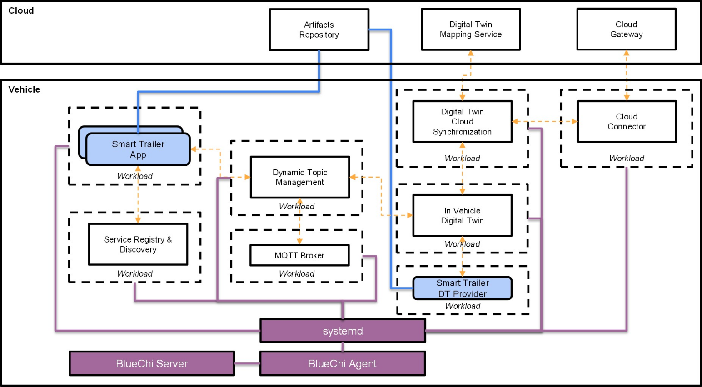

# Eclipse BlueChi



This document describes how to run the Eclipse Software Orchestration blueprint using Eclipse BlueChi.

Check [this document](./what-is-bluechi.md) out in case you need a quick introduction to the project.

## Prerequisites

* A container runtime such as [Docker](https://docs.docker.com/get-docker/) or [Podman](https://podman.io/docs/installation)
  * [Devcontainers](./https://containers.dev/) can also be used on top of such runtimes

**_NOTE:_** non linux machines need to run docker/podman machine or similar technology.

## Development Environment

This section describes how to run this blueprint using Eclipse Bluechi.

### Devcontainers + VSCode

This section describes how to run the blueprint using the VSCode devcontainer extension.

#### Prerequisites

* Ensure that the [Remote Development extension](https://marketplace.visualstudio.com/items?itemName=ms-vscode-remote.vscode-remote-extensionpack) is installed in VSCode

* Upstream documentation:
  * <https://containers.dev/>
  * https://github.com/devcontainers/cli

#### Instructions

1. You can use the VSCode devcontainer extension to start your containerized development environment.
    ```shell
    cd <absolute/path/to>/software-orchestration/eclipse-bluechi
    code .
    ```

1. VSCode detects automatically that a `.devcontainer` folder exists inside this subfolder. Please confirm the dialog to reopen VSCode inside the devcontainer. Afterwards, open a new terminal inside the devcontainer in VSCode.

### Devcontainers CLI

#### Prerequisites

Ensure you have the `devcontainer` cli installed: https://github.com/devcontainers/cli?tab=readme-ov-file#try-it-out

#### Instructions

Run the following from `<absolute/path/to>/software-orchestration/eclipse-bluechi`:

```sh
devcontainer up \
--workspace-dir .
```

You will need to specify the `--docker-path` option if you are using Podman:

```sh
devcontainer up \
--workspace-dir . \
--docker-patch /usr/bin/podman
```

You can now enter into the devcontainer and interact with Eclipse BlueChi:

```sh
docker exec -it $container_id_or_name /bin/bash
bluechictl list-units
```

### Docker/Podman

You can also run this blueprint directly with Docker or Podman.

Start the blueprint container by running:

```sh
docker run \
--privileged \
--replace \
--name esdv \
-d \
-v $PWD/workspace/workloads:/etc/containers/systemd \
-v $PWD/workspace/src:/workspace \
--workdir /workspace \
quay.io/centos-sig-automotive/autosd:latest
```

The container will be running in the background and you can enter into it by running:

```sh
docker exec -it esdv /bin/bash
```

Enter into the devcontainer and interact with BlueChi:

```sh
docker exec -it esdv /bin/bash
bluechictl list-units
```

## Managing Workloads

This section describes how to deploy and perform administrative's tasks using
systemd and BlueChi.

### Deploying Applications

BlueChi relies on three components to handle containerized applications:

* systemd
* Quadlet
* Podman

Application definitions are stored in `/etc/containers/systemd`. An application
needs two essential files:

* `{SERVICE_NAME}.kube`: Used by systemd to point to a Kubernetes resource definition
  containing the workload definition.

  Example of `freyja.kube`:
    ```kube
    # https://docs.podman.io/en/latest/markdown/podman-systemd.unit.5.html
    [Kube]
    Yaml=freyja.yml

    # Commented to disable the service to automatically start
    # [Install]
    # WantedBy=default.target
    ```
* `{SERVICE_NAME}.yaml`: A Kubernetes resource definition (either `v1.Pod` or
  `apps/v1.Deployment`) that describes the workload.

  Example of `freyja.yml`:
    ```yaml
    ---
    apiVersion: apps/v1
    kind: Deployment
    metadata:
      labels:
        app: freyja
      name: freyja
    spec:
      replicas: 1
      selector:
        matchLabels:
          app: freyja
      template:
        metadata:
          labels:
            app: freyja
        spec:
          hostNetwork: true
          containers:
            - name: local
              image: ghcr.io/eclipse-sdv-blueprints/software-orchestration/eclipse-freyja/local-with-ibeji:0.1.0
              imagePullPolicy: IfNotPresent
    ```

If you edit the source code of a component then build and push an image of it to your container registry, you will need to edit the corresponding `{SERVICE_NAME}.yaml` file in the `/etc/containers/systemd` directory. The value of the `image` field in the `{SERVICE_NAME}.yaml` file should point to the image in your container registry.

Creating, changing or updating a file in `/etc/containers/systemd` requires you to run `systemctl daemon-reload` afterwards to generate the corresponding systemd unit files in
`/run/systemd/generator`.

### Service Lifecycle

Services can be managed by using `systemctl`, systemd's administrative CLI.

Starting, stopping, restarting services is as easy as:

* `systemctl stop {SERVICE_NAME}`
* `systemctl start {SERVICE_NAME}`
* `systemctl restart {SERVICE_NAME}`

> Make sure to run `systemctl daemon-reload` in case something changed in either Quadlet or systemd unit files.

### Monitoring and Logs

BlueChi's CLI (`bluechictl`), can be used to retrieve information from
managed nodes:
<https://github.com/eclipse-bluechi/bluechi/blob/main/doc/man/bluechictl.1.md>.

#### Using Systemctl

Simply run `systemctl status {SERVICE_NAME}` where `{SERVICE_NAME}` is the name of your .kube file.

#### Using journalctl

This is valid for any systemd defined service, simply run `journalctl -xeu {SERVICE_NAME}`

#### Podman

You can also list all active containers by running `podman ps` and then `podman logs {CONTAINER_NAME_OR_ID}` to
get logs from the container using podman. Replace `{CONTAINER_NAME_OR_ID}` with the container's name or ID.
